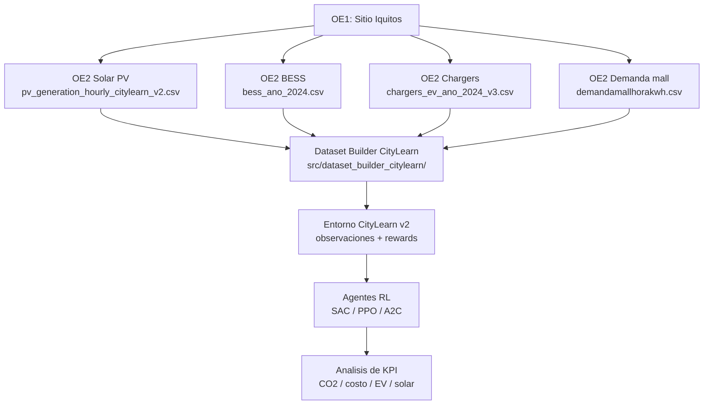

# Informe final de tesis: pvbesscar

**Proyecto:** Optimizacion de carga de vehiculos electricos con Solar PV + BESS mediante aprendizaje por refuerzo  
**Caso de estudio:** Centro comercial en Iquitos, Peru  
**Version del informe:** 2026-06-24  
**Repositorio:** `pvbesscar`

---

## Resumen ejecutivo

Este informe consolida el estado tecnico del proyecto `pvbesscar`, orientado a optimizar la carga de motos y mototaxis electricos en Iquitos mediante un sistema integrado de generacion fotovoltaica, almacenamiento BESS y agentes de aprendizaje por refuerzo. La arquitectura integra datos horarios de 2024 para generacion solar, demanda del centro comercial, cargadores EV y operacion BESS, con el objetivo de reducir emisiones de CO2, aumentar autoconsumo solar y satisfacer la demanda de carga vehicular.

La infraestructura validada considera 19 cargadores modo 3 con 2 tomas cada uno, para un total de 38 sockets controlables de 7.4 kW. El escenario EV recomendado modela 270 motos y 39 mototaxis por dia. La generacion solar horaria actual suma 8,292,514 kWh anuales, mientras que el dataset principal de cargadores suma 565,875 kWh anuales de demanda EV. Con los factores de cambio de combustible definidos en el proyecto, la reduccion directa anual por electrificacion es 456,561 kg CO2; al descontar las emisiones de la red aislada diesel de Iquitos, el beneficio neto en el dataset de cargadores es 200,729 kg CO2 anuales.

Los resultados documentados para agentes RL reportan a SAC como mejor alternativa multiobjetivo, con score 8.2/10 y 65.7% de reduccion CO2 frente al baseline definido en la documentacion del proyecto. Sin embargo, los artefactos de entrenamiento (`checkpoints/`, `outputs/`, `reports/`) no estan presentes en esta copia del repositorio; por tanto, esos resultados deben citarse como resultados documentales y reproducirse con los scripts de entrenamiento antes de ser tratados como evidencia experimental cerrada.

---

## 1. Objetivo del trabajo

El objetivo general es disenar y validar un sistema de gestion energetica para carga de motos y mototaxis electricos en Iquitos, combinando:

- Generacion solar fotovoltaica en el sitio.
- Sistema de almacenamiento BESS.
- Cargadores EV distribuidos en 38 sockets.
- Modelado horario compatible con CityLearn v2.
- Agentes RL SAC, PPO y A2C para control multiobjetivo.

Los objetivos operativos son:

1. Reducir emisiones de CO2 asociadas al transporte y a la importacion electrica desde la red aislada.
2. Maximizar autoconsumo solar directo.
3. Satisfacer la demanda diaria de carga EV.
4. Mantener estabilidad de red mediante rampas suaves.
5. Reducir costos electricos bajo tarifas horarias.

Fuentes principales: `README.md`, `configs/default.yaml`, `src/dataset_builder_citylearn/RUTAS_DATOS_FIJAS_v57.md`.

---

## 2. Alcance y caso de estudio

El caso de estudio se ubica en Iquitos, Peru, donde la red electrica es aislada y mayormente termica. El proyecto usa un factor de emisiones de red de `0.4521 kg CO2/kWh`.

### Infraestructura EV

| Parametro | Valor |
|---|---:|
| Cargadores | 19 |
| Tomas por cargador | 2 |
| Sockets controlables | 38 |
| Potencia por socket | 7.4 kW |
| Potencia EV instalada | 281.2 kW |
| Demanda objetivo diaria | 270 motos + 39 mototaxis |

Fuentes: `data/oe2/chargers/tabla_infraestructura.csv`, `data/oe2/chargers/tabla_parametros.csv`, `src/dataset_builder_citylearn/RUTAS_DATOS_FIJAS_v57.md`.

### Sistema fotovoltaico

| Parametro | Valor |
|---|---:|
| Capacidad operativa usada por el dataset | 4,050 kWp |
| Capacidad DC nominal reportada en informe solar | 4,162 kWp |
| Capacidad AC nominal | 3,201 kW |
| Energia AC anual validada | 8,292,514 kWh |
| Potencia AC maxima | 2,886.7 kW |
| Resolucion | 1 hora |

Fuentes: `data/oe2/Generacionsolar/solar_technical_report.md`, `data/oe2/Generacionsolar/pv_generation_hourly_citylearn_v2.csv`, verificacion directa del CSV.

### Sistema BESS

| Parametro | Valor |
|---|---:|
| Capacidad energetica | 1,700 kWh |
| Potencia maxima de carga/descarga | 400 kW |
| Resolucion | 1 hora |

Fuente primaria: `src/dataset_builder_citylearn/RUTAS_DATOS_FIJAS_v57.md`. La potencia de 400 kW se toma como valor vigente del dataset builder; documentos antiguos mencionan 342 kW y deben tratarse como historicos.

---

## 3. Arquitectura del sistema



Componentes de codigo:

| Capa | Ruta | Funcion |
|---|---|---|
| Sitio | `src/dimensionamiento/oe1/location.py` | Parametros geograficos y del mall |
| Solar | `src/dimensionamiento/oe2/generacionsolar/` | Modelado PVGIS/pvlib y generacion horaria |
| BESS | `src/dimensionamiento/oe2/disenobess/` | Simulacion de almacenamiento |
| Chargers | `src/dimensionamiento/oe2/disenocargadoresev/chargers.py` | Simulacion anual de sockets, energia y CO2 |
| Balance | `src/dimensionamiento/oe2/balance_energetico/` | Integracion energetica |
| Dataset builder | `src/dataset_builder_citylearn/` | Construccion de datos compatibles con CityLearn |
| Agentes | `src/agents/` | Implementaciones SAC, PPO y A2C |
| Entrenamiento | `scripts/train/` | Pipelines de entrenamiento |
| Analisis | `scripts/analysis/` | Comparativas y graficas |

---

## 4. Datos utilizados y validacion

El dataset builder define cuatro rutas primarias obligatorias:

| Dataset | Ruta | Filas actuales | Uso |
|---|---|---:|---|
| Solar | `data/oe2/Generacionsolar/pv_generation_hourly_citylearn_v2.csv` | 8,760 | Generacion PV horaria |
| BESS | `data/oe2/bess/bess_ano_2024.csv` | 8,760 | Balance carga/descarga |
| Chargers | `data/oe2/chargers/chargers_ev_ano_2024_v3.csv` | 8,760 | Demanda EV, sockets, CO2 |
| Mall | `data/oe2/demandamallkwh/demandamallhorakwh.csv` | 8,760 | Demanda no desplazable |

Verificacion ejecutada con Python estandar en esta copia del repositorio.

### Metricas anuales verificadas desde CSV

| Componente | Metrica | Valor |
|---|---|---:|
| Solar | Energia AC / `pv_kwh` | 8,292,514 kWh |
| Solar | Reduccion indirecta registrada | 3,749,046 kg CO2 |
| Solar | Ahorro solar registrado | 2,321,904 soles |
| Chargers | Energia EV total | 565,875 kWh |
| Chargers | Energia motos | 476,501 kWh |
| Chargers | Energia mototaxis | 89,374 kWh |
| Mall | Demanda anual | 12,368,653 kWh |
| BESS | Generacion PV de entrada | 8,292,514 kWh |
| BESS | Grid import total | 6,485,565 kWh |

### Nota critica sobre sincronizacion de datos

`data/oe2/bess/bess_ano_2024.csv` mantiene `ev_demand_kwh = 412,236 kWh/anio`, mientras que el dataset vigente de cargadores `data/oe2/chargers/chargers_ev_ano_2024_v3.csv` suma `565,875 kWh/anio`. Para el informe final se toma el dataset de cargadores como fuente autoritativa de demanda EV, porque esta respaldado por `REPORTE_FINAL_V52_LIMPIEZA.md`, `CORRECCION_DATOS_2026-02-16.md` y la verificacion directa del CSV. La discrepancia debe resolverse antes de una corrida experimental final que integre BESS y chargers en un unico entorno.

---

## 5. Modelo de emisiones de CO2

El proyecto distingue tres conceptos:

1. **Reduccion directa de CO2:** gasolina que no se quema por reemplazar motos/mototaxis de combustion por EV.
2. **CO2 grid:** emisiones por electricidad importada desde la red diesel aislada.
3. **CO2 neto:** reduccion directa menos emisiones del grid.

Formulas:

```text
reduccion_directa_co2_kg =
  energia_motos_kwh * 0.87 + energia_mototaxis_kwh * 0.47

co2_grid_kg =
  energia_ev_total_kwh * 0.4521

co2_neto_kg =
  reduccion_directa_co2_kg - co2_grid_kg
```

Factores:

| Factor | Valor | Interpretacion |
|---|---:|---|
| Motos | 0.87 kg CO2/kWh | Emisiones evitadas de gasolina |
| Mototaxis | 0.47 kg CO2/kWh | Emisiones evitadas de gasolina |
| Red Iquitos | 0.4521 kg CO2/kWh | Emisiones de generacion diesel |

Resultados anuales del dataset de cargadores:

| Metrica | Valor |
|---|---:|
| Reduccion directa motos | 414,555 kg CO2 |
| Reduccion directa mototaxis | 42,006 kg CO2 |
| Reduccion directa total | 456,561 kg CO2 |
| CO2 grid por carga EV | 255,832 kg CO2 |
| CO2 neto | 200,729 kg CO2 |

Fuentes: `ESPECIFICACION_CO2_REDUCCION_DIRECTA_vs_NETO.md`, `CIERRE_FINAL_CO2_BIEN_CLARO.md`, `VERIFICACION_CO2_TERMINOLOGIA.py`, verificacion directa del CSV.

---

## 6. Entorno de aprendizaje por refuerzo

La configuracion documentada de CityLearn v2 usa:

| Elemento | Valor |
|---|---:|
| Dimension de observacion estandar | 156 |
| Dimension de accion | 39 |
| Acciones | 1 control BESS + 38 controles de sockets |
| Agentes considerados | SAC, PPO, A2C |

Fuente: `data/processed/citylearn/iquitos_ev_mall/metadata/METADATA_v57.json`.

### Funcion de recompensa multiobjetivo

| Componente | Peso |
|---|---:|
| Reduccion CO2 / importacion grid | 0.30 |
| Satisfaccion EV | 0.35 |
| Autoconsumo solar | 0.20 |
| Minimizacion de costo | 0.10 |
| Estabilidad de red | 0.05 |

La recompensa busca equilibrar beneficios ambientales, servicio al usuario, uso de energia renovable, costo y estabilidad operativa.

---

## 7. Resultados documentados de agentes RL

Los resultados reportados en `README.md` identifican a SAC como el agente recomendado:

| Agente | Score multiobjetivo | Reduccion CO2 documentada | Timesteps | Episodios |
|---|---:|---:|---:|---:|
| SAC | 8.2/10 | 5.57M kg (65.7%) | 280,320 | 10 |
| PPO | 5.9/10 | 4.31M kg (50.9%) | 87,600 | 10 |
| A2C | 3.1/10 | 4.24M kg (50.1%) | 87,600 | 10 |

Interpretacion:

- SAC domina los objetivos de CO2, autoconsumo solar y satisfaccion EV segun la documentacion.
- PPO aparece como alternativa secundaria si se prioriza costo y uso de BESS.
- A2C queda como referencia base de menor desempeno multiobjetivo.

Limitacion: en esta copia del repositorio no existen los directorios `checkpoints/`, `outputs/` ni `reports/` citados por el README. Por ello, los resultados anteriores deben reproducirse con los scripts de `scripts/train/` y `scripts/analysis/` antes de usarse como evidencia experimental definitiva.

---

## 8. Reproducibilidad

### Validar datasets OE2

```bash
python3 scripts/validate_oe2_datasets.py
```

Si el entorno no tiene dependencias instaladas, se debe crear el entorno Python del proyecto e instalar `requirements.txt` y, para entrenamiento, `requirements-training.txt` si existe en la rama de trabajo.

### Reconstruir dataset CityLearn

```bash
python3 -m src.dataset_builder_citylearn.main_build_citylearn
```

### Entrenar agentes

```bash
python3 scripts/train/train_sac_multiobjetivo.py
python3 scripts/train/train_ppo_multiobjetivo.py
python3 scripts/train/train_a2c_multiobjetivo.py
```

### Analizar resultados

```bash
python3 scripts/analysis/compare_agents_sac_ppo_a2c.py
```

Nota: varios documentos antiguos mencionan `ejecutar.py`, `compare_agents_complete.py`, `docs/`, `reports/` o `checkpoints/`; esos artefactos no estan presentes en esta copia del repositorio y no deben usarse como comandos principales sin verificar su existencia.

---

## 9. Hallazgos principales

1. El sistema EV corregido y vigente demanda 565,875 kWh/anio, distribuidos en 476,501 kWh para motos y 89,374 kWh para mototaxis.
2. La electrificacion produce 456,561 kg CO2/anio de reduccion directa por cambio de combustible.
3. Considerando la red diesel de Iquitos, el beneficio neto del dataset de cargadores es 200,729 kg CO2/anio.
4. La generacion solar horaria disponible suma 8.29 GWh/anio, suficiente para que la estrategia de control busque alta cobertura solar de la carga EV y parte de la demanda del mall.
5. La configuracion RL documentada usa observacion de 156 dimensiones y accion de 39 dimensiones, compatible con control BESS + 38 sockets.
6. SAC es el mejor agente segun resultados documentados, pero los artefactos experimentales no estan incluidos en el repositorio actual.
7. Existe una discrepancia entre la demanda EV del archivo BESS y la demanda EV del archivo de cargadores; debe corregirse antes de una validacion experimental final integrada.

---

## 10. Limitaciones

- Los checkpoints y outputs de entrenamiento no estan versionados en esta copia del repositorio.
- Parte del README contiene referencias a rutas que no existen actualmente (`docs/`, `reports/`, `outputs/`, `checkpoints/`).
- Hay documentos historicos con valores previos a la correccion de febrero de 2026; este informe prioriza los CSV actuales y los documentos de correccion v5.2/v5.7.
- El dataset BESS debe sincronizarse con el dataset EV corregido para evitar mezclar 412,236 kWh/anio y 565,875 kWh/anio en una misma corrida.
- La metrica de reduccion CO2 de agentes RL debe explicitar su baseline para no mezclarla con la reduccion directa de combustible ni con el CO2 neto de cargadores.

---

## 11. Conclusiones

El proyecto `pvbesscar` cuenta con una base de datos horaria completa para modelar un sistema PV + BESS + EV en Iquitos y con una definicion clara del problema de optimizacion multiobjetivo. La contribucion tecnica principal es la integracion de infraestructura EV realista, energia solar local, almacenamiento y control RL para reducir emisiones y mejorar la operacion energetica del mall.

Con los datos actuales, la electrificacion de motos y mototaxis ya ofrece un beneficio neto aun bajo una red diesel aislada: 200.7 Mg CO2/anio. El potencial mejora cuando la carga se coordina con la generacion solar y el BESS. Segun los resultados documentados, SAC es el candidato mas solido para produccion por su balance entre reduccion de CO2, uso solar y satisfaccion EV.

Para cerrar la tesis con evidencia reproducible, el siguiente paso tecnico es sincronizar el dataset BESS con la demanda EV corregida, ejecutar nuevamente el pipeline CityLearn y regenerar checkpoints, metricas y graficas con los scripts actuales del repositorio.

---

## 12. Fuentes internas recomendadas para citar

| Tema | Fuente |
|---|---|
| Vision general y resultados RL | `README.md` |
| Rutas source of truth | `src/dataset_builder_citylearn/RUTAS_DATOS_FIJAS_v57.md` |
| Metadatos CityLearn | `data/processed/citylearn/iquitos_ev_mall/metadata/METADATA_v57.json` |
| Correccion de datos EV | `CORRECCION_DATOS_2026-02-16.md` |
| Limpieza v5.2 | `REPORTE_FINAL_V52_LIMPIEZA.md` |
| CO2 directo vs neto | `ESPECIFICACION_CO2_REDUCCION_DIRECTA_vs_NETO.md` |
| Cierre CO2 | `CIERRE_FINAL_CO2_BIEN_CLARO.md` |
| Reporte solar | `data/oe2/Generacionsolar/solar_technical_report.md` |
| Parametros completos | `PARAMETROS_METRICAS_PASOS_COMPLETO.txt` |
| Bibliografia | `deprecated/REFERENCIAS_BIBLIOGRAFICAS_COMPLETAS.md` |

