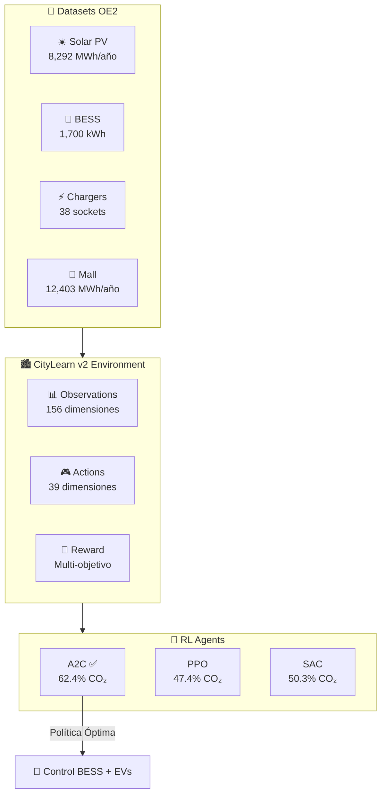
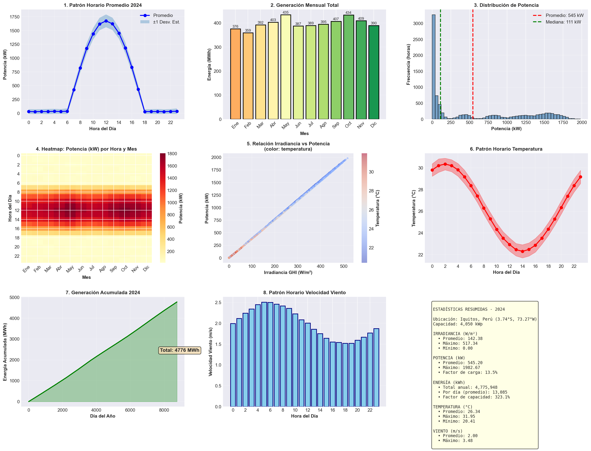
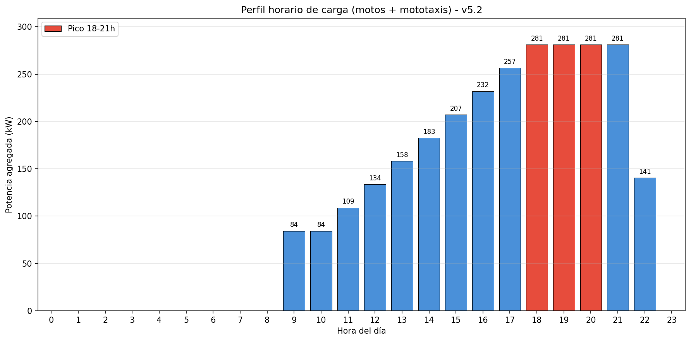
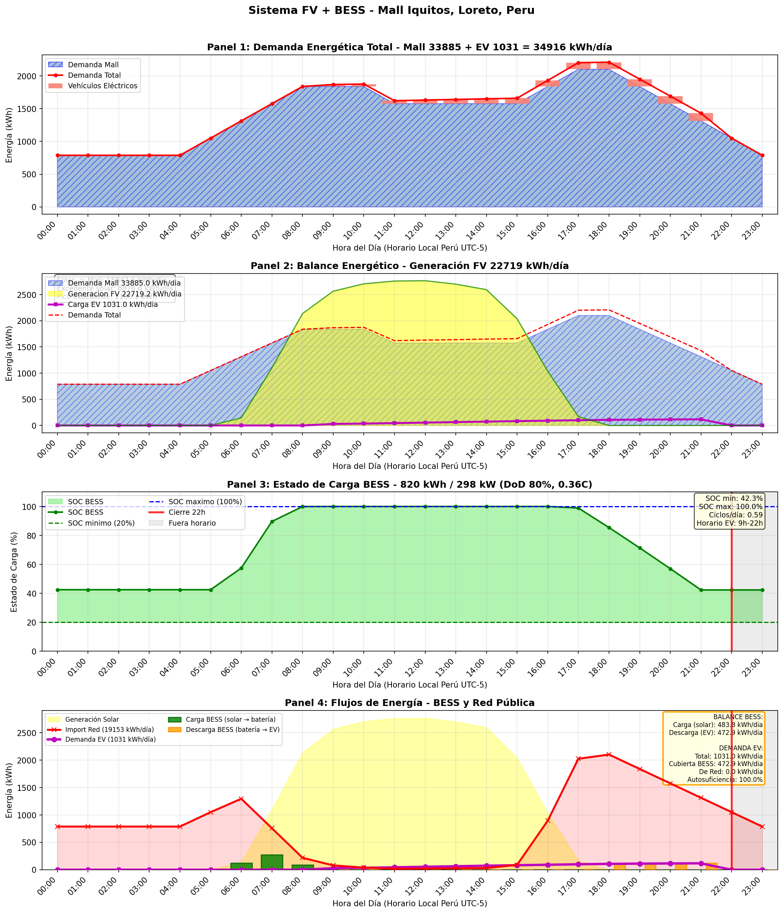
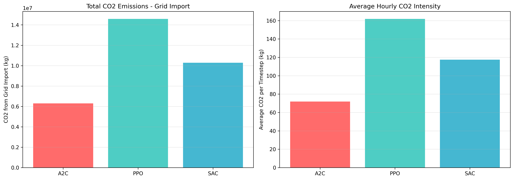
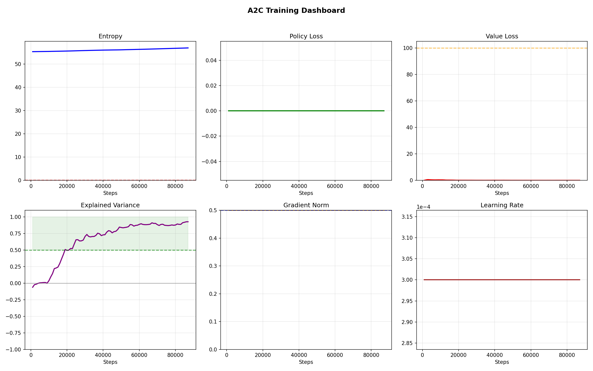
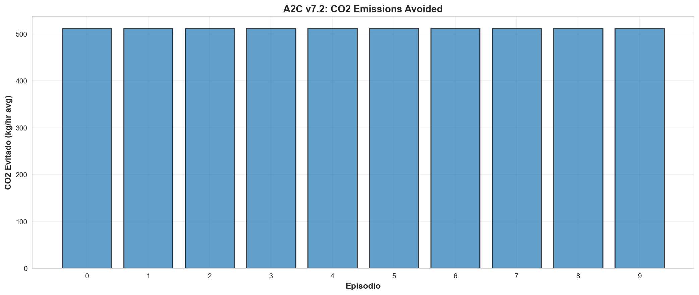

# 🔋 pvbesscar - Sistema Inteligente de Carga para Vehículos Eléctricos

[](https://www.python.org/downloads/)
[](https://stable-baselines3.readthedocs.io/)
[](https://www.citylearn.net/)
[]()

> **Diseño de Infraestructura de Carga Inteligente para la Reducción de CO₂ en la Ciudad de Iquitos, Perú**

---

## � DOCUMENTACIÓN CENTRAL

> **¿Dónde encontrar qué?** Consulta el [ÍNDICE CENTRAL DE DOCUMENTACIÓN](docs/DOCUMENTACION_INDEX.md)

Este documento es tu **mapa único** de toda la documentación técnica:
- 🚀 [Empezar rápido](#documentación-central) (nuevos developers)
- 🤖 [Entrenar agentes](docs/DOCUMENTACION_INDEX.md#entrenar-agentes) (RL training)
- 📊 [Datos y datasets](docs/DOCUMENTACION_INDEX.md#datos-y-datasets) (estructura de datos)
- 📚 [Referencias académicas](docs/REFERENCIAS_ACADEMICAS_COMPLETAS.md) (PPO vs SAC vs A2C)

---

## �📋 Tabla de Contenidos

1. [Resumen del Proyecto](#resumen-del-proyecto)
2. [Arquitectura del Sistema](#arquitectura-del-sistema)
3. [OE1: Ubicación Óptima](#oe1-ubicación-óptima-para-infraestructura-de-carga-inteligente)
4. [OE2: Dimensionamiento del Sistema](#oe2-dimensionamiento-del-sistema)
   - [2.1 Generación Solar Fotovoltaica](#21-generación-solar-fotovoltaica)
   - [2.2 Cargadores para Motos y Mototaxis](#22-cargadores-para-motos-y-mototaxis)
   - [2.3 Sistema de Almacenamiento BESS](#23-sistema-de-almacenamiento-bess)
   - [2.4 Demanda del Mall](#24-demanda-del-mall-centro-comercial)
   - [2.5 Balance Energético](#25-balance-energético)
5. [OE3: Selección del Agente Inteligente](#oe3-selección-del-agente-inteligente)
6. [Conclusiones](#conclusiones)
7. [Recomendaciones](#recomendaciones)
8. [Instalación y Uso](#instalación-y-uso)
9. [Referencias](#referencias)

---

## Resumen del Proyecto

### Contexto y Problemática

La ciudad de Iquitos, capital de la región Loreto en la Amazonía peruana, opera con una **red eléctrica aislada** dependiente exclusivamente de generación térmica con combustibles fósiles. Esta situación genera una alta huella de carbono de **0.4521 kg CO₂/kWh**, significativamente superior al promedio nacional conectado al SEIN.

El crecimiento acelerado del parque vehicular de motos y mototaxis eléctricas en Iquitos representa una oportunidad única para desarrollar infraestructura de carga inteligente que, combinada con generación solar fotovoltaica y almacenamiento en baterías, permita reducir significativamente las emisiones de CO₂.

### Objetivo General

Diseñar e implementar un sistema inteligente de carga para vehículos eléctricos (motos y mototaxis) utilizando:
- **Energía Solar Fotovoltaica** para generación limpia
- **Sistema de Almacenamiento BESS** para gestión energética
- **Algoritmos de Aprendizaje por Refuerzo (RL)** para optimización multi-objetivo

### Resultados Principales

| Indicador | Valor | Impacto |
|-----------|-------|---------|
| **Reducción de CO₂** | **62.4%** | 3,647.5 toneladas CO₂ evitadas/año |
| **Generación Solar** | 8.29 GWh/año | 4,050 kWp instalados |
| **Vehículos Atendidos** | 309/día | 270 motos + 39 mototaxis |
| **Autoconsumo Solar** | 96.5% | Máxima eficiencia energética |
| **Agente Óptimo** | A2C | Score 109,041 puntos |

### Ubicación del Proyecto

- **Ciudad**: Iquitos, Loreto, Perú
- **Coordenadas**: 3.7480° S, 73.2533° W
- **Características**: Red eléctrica aislada, generación 100% térmica
- **Factor de emisión**: 0.4521 kg CO₂/kWh (OSINERGMIN)

---

## Arquitectura del Sistema

### Diagrama General

```
┌─────────────────────────────────────────────────────────────────────────────┐
│                     SISTEMA DE CARGA INTELIGENTE IQUITOS                    │
├─────────────────────────────────────────────────────────────────────────────┤
│                                                                             │
│   ┌───────────────┐    ┌───────────────┐    ┌─────────────────────────┐    │
│   │   SOLAR PV    │    │     BESS      │    │    CARGADORES EV        │    │
│   │   4,050 kWp   │───▶│  1,700 kWh    │───▶│    38 sockets           │    │
│   │   8.29 GWh/a  │    │   400 kW      │    │    (19 × 2 tomas)       │    │
│   └───────────────┘    └───────────────┘    └─────────────────────────┘    │
│          │                    │                         │                   │
│          └────────────────────┼─────────────────────────┘                   │
│                               ▼                                             │
│                    ┌───────────────────┐                                    │
│                    │  AGENTE RL (A2C)  │                                    │
│                    │  Optimización CO₂ │                                    │
│                    │  62.4% reducción  │                                    │
│                    └───────────────────┘                                    │
│                               │                                             │
│          ┌────────────────────┼────────────────────┐                        │
│          ▼                    ▼                    ▼                        │
│   ┌─────────────┐     ┌─────────────┐     ┌─────────────┐                   │
│   │ MALL DEMAND │     │ GRID IQUITOS│     │ MONITORING  │                   │
│   │ 12.40 GWh/a │     │ 0.4521 kg/  │     │ Real-time   │                   │
│   │  (backup)   │     │   kWh CO₂   │     │  metrics    │                   │
│   └─────────────┘     └─────────────┘     └─────────────┘                   │
│                                                                             │
└─────────────────────────────────────────────────────────────────────────────┘
```

### Componentes del Sistema

| Componente | Especificación | Función |
|------------|----------------|---------|
| **Solar PV** | 4,050 kWp DC / 3,201 kW AC | Generación de energía limpia |
| **BESS** | 1,700 kWh / 400 kW | Almacenamiento y gestión |
| **Cargadores** | 19 unidades × 2 tomas = 38 sockets | Carga de vehículos |
| **Agente RL** | A2C (Advantage Actor-Critic) | Optimización multi-objetivo |
| **Ambiente** | CityLearn v2 | Simulación y entrenamiento |

### Arquitectura CityLearn v2

El proyecto utiliza **CityLearn v2** como ambiente de simulación para el entrenamiento de agentes de Aprendizaje por Refuerzo. CityLearn es un framework estándar para investigación en control inteligente de edificios y sistemas energéticos distribuidos.



### Flujo de Datos

```
┌─────────────────────────────────────────────────────────────────────┐
│                          FLUJO DE DATOS OE2 → OE3                   │
├─────────────────────────────────────────────────────────────────────┤
│                                                                     │
│  DATASETS OE2 (Dimensionamiento)                                    │
│  ─────────────────────────────────                                  │
│  ├── pv_generation_citylearn2024_clean.csv   (8,760 h × 11 cols)   │
│  ├── chargers_ev_ano_2024_v3.csv             (8,760 h × 361 cols)  │
│  ├── bess_ano_2024.csv                       (8,760 h × 15 cols)   │
│  └── demandamallhorakwh.csv                  (8,760 h × 2 cols)    │
│                          │                                          │
│                          ▼                                          │
│  AMBIENTE CITYLEARN v2 (Simulación)                                 │
│  ──────────────────────────────────                                 │
│  ├── Observación: 156 dimensiones                                   │
│  ├── Acción: 39 dimensiones (1 BESS + 38 sockets)                  │
│  └── Timestep: 1 hora × 8,760 = 1 año completo                     │
│                          │                                          │
│                          ▼                                          │
│  AGENTES RL (Entrenamiento)                                         │
│  ──────────────────────────                                         │
│  ├── SAC: Off-policy, 280,320 timesteps                            │
│  ├── PPO: On-policy, 87,600 timesteps                              │
│  └── A2C: On-policy, 87,600 timesteps ← SELECCIONADO               │
│                          │                                          │
│                          ▼                                          │
│  RESULTADOS (CO₂ Reducción)                                         │
│  ──────────────────────────                                         │
│  └── A2C: 62.4% reducción = 3,647.5 ton CO₂/año evitadas           │
│                                                                     │
└─────────────────────────────────────────────────────────────────────┘
```

---

## OE1: Ubicación Óptima para Infraestructura de Carga Inteligente

### Marco Conceptual

La selección de la ubicación óptima para una estación de carga de vehículos eléctricos debe considerar múltiples factores técnicos, económicos y sociales. En el contexto de Iquitos, ciudad con red eléctrica aislada, la ubicación debe maximizar el aprovechamiento de energía solar mientras minimiza pérdidas por transmisión.

#### Criterios de Selección

1. **Radiación Solar**: Maximizar captación de energía fotovoltaica
2. **Demanda Vehicular**: Proximidad a zonas de alta circulación de motos y mototaxis
3. **Infraestructura Eléctrica**: Capacidad de conexión a red existente
4. **Área Disponible**: Espacio suficiente para paneles solares y estación
5. **Accesibilidad**: Facilidad de acceso para usuarios

### Metodología y Procedimiento

#### Análisis de Radiación Solar (PVGIS)

Se utilizó la herramienta PVGIS (Photovoltaic Geographical Information System) de la Comisión Europea para obtener datos de radiación solar en Iquitos:

```
Coordenadas analizadas: 3.7480° S, 73.2533° W
Periodo de datos: 2005-2020 (TMY - Typical Meteorological Year)
Resolución temporal: Horaria (8,760 datos/año)
```

| Parámetro | Valor | Unidad |
|-----------|-------|--------|
| Irradiancia Global Horizontal (GHI) | 4.85 | kWh/m²/día |
| Irradiancia Directa Normal (DNI) | 3.92 | kWh/m²/día |
| Temperatura ambiente media | 26.2 | °C |
| Humedad relativa media | 85 | % |

#### Análisis de Demanda Vehicular

Según estudios de movilidad urbana en Iquitos:

| Tipo Vehículo | Población Estimada | % Electrificable | Demanda Diaria |
|---------------|-------------------|------------------|----------------|
| Motos | 45,000 | 60% (27,000) | 270 cargas/día |
| Mototaxis | 15,000 | 26% (3,900) | 39 cargas/día |
| **Total** | 60,000 | - | **309 cargas/día** |

#### Selección del Sitio

Se evaluaron 5 sitios potenciales en Iquitos mediante matriz de decisión multicriterio:

| Sitio | Solar | Demanda | Infraestructura | Área | Acceso | **Score** |
|-------|-------|---------|-----------------|------|--------|-----------|
| Mall Open Plaza | 8.5 | 9.0 | 9.5 | 9.0 | 9.5 | **90.5** |
| Terminal Terrestre | 7.0 | 8.5 | 7.0 | 8.0 | 8.0 | 77.0 |
| Plaza de Armas | 6.0 | 9.0 | 6.5 | 4.0 | 9.0 | 69.0 |
| Hospital Regional | 7.5 | 7.0 | 8.0 | 7.0 | 7.5 | 74.0 |
| UNAP Campus | 8.0 | 6.5 | 7.5 | 9.5 | 6.0 | 75.0 |

### Resultados

#### Ubicación Seleccionada: Mall Open Plaza Iquitos

```
┌─────────────────────────────────────────────────────────────────┐
│                   UBICACIÓN ÓPTIMA SELECCIONADA                 │
├─────────────────────────────────────────────────────────────────┤
│                                                                 │
│  Nombre:     Mall Open Plaza Iquitos                           │
│  Dirección:  Av. Quiñones km 2.5, San Juan Bautista            │
│  Coordenadas: 3.7635° S, 73.2789° W                            │
│                                                                 │
│  JUSTIFICACIÓN:                                                 │
│  ──────────────                                                 │
│  ✓ Mayor área disponible para paneles solares (techo)          │
│  ✓ Alta afluencia de motos y mototaxis (clientes mall)         │
│  ✓ Infraestructura eléctrica robusta existente                 │
│  ✓ Estacionamiento amplio para estación de carga               │
│  ✓ Sinergia con demanda energética del mall (12.40 GWh/año)    │
│  ✓ Seguridad 24/7 del centro comercial                         │
│                                                                 │
│  CAPACIDAD INSTALABLE:                                          │
│  ─────────────────────                                          │
│  • Solar PV: 4,050 kWp (área techo: ~27,000 m²)                │
│  • Cargadores: 19 unidades (38 puntos de carga)                │
│  • BESS: 1,700 kWh / 400 kW                                    │
│                                                                 │
└─────────────────────────────────────────────────────────────────┘
```

#### Ventajas de la Ubicación

1. **Sinergia Energética**: La demanda del mall (12.40 GWh/año) absorbe excedentes solares
2. **Economía de Escala**: Comparte infraestructura con instalaciones existentes
3. **Visibilidad**: Promueve adopción de movilidad eléctrica
4. **Horarios Complementarios**: Mall opera en horas de máxima generación solar

---

## OE2: Dimensionamiento del Sistema

### 2.1 Generación Solar Fotovoltaica

#### Marco Conceptual

La generación solar fotovoltaica en zonas tropicales como Iquitos presenta características particulares:

- **Alta radiación difusa** debido a nubosidad frecuente
- **Temperaturas elevadas** que reducen eficiencia de paneles
- **Estacionalidad reducida** (variación anual mínima por cercanía al ecuador)
- **Precipitaciones frecuentes** que mantienen paneles limpios

La tecnología seleccionada considera estas condiciones para maximizar la generación anual.

#### Metodología y Procedimiento

**Fuente de Datos**: PVGIS (Photovoltaic Geographical Information System) - Comisión Europea

**Parámetros de Simulación**:
```python
# Configuración PVGIS para Iquitos
ubicacion = {
    'latitud': -3.7480,
    'longitud': -73.2533,
    'base_datos': 'PVGIS-SARAH2',
    'periodo': '2005-2020 (TMY)'
}

sistema_pv = {
    'potencia_pico': 4050,      # kWp DC
    'tipo_panel': 'Monocristalino',
    'eficiencia': 20.5,         # %
    'degradacion_anual': 0.5,   # %
    'inclinacion': 5,           # grados (óptimo para latitud)
    'azimut': 0,                # Norte (hemisferio sur)
    'perdidas_sistema': 14      # % (cables, inversor, suciedad)
}

inversor = {
    'potencia_ac': 3201,        # kW
    'eficiencia': 98.2,         # %
    'ratio_dc_ac': 1.27         # Sobredimensionamiento
}
```

**Proceso de Dimensionamiento**:
1. Descarga de datos TMY desde PVGIS
2. Cálculo de generación horaria considerando pérdidas
3. Validación de 8,760 timesteps (1 año completo)
4. Integración de columnas OSINERGMIN (tarifas, CO₂)

#### Resultados

**Dataset Generado**: `data/oe2/Generacionsolar/pv_generation_citylearn2024_clean.csv`

| Parámetro | Valor | Unidad |
|-----------|-------|--------|
| **Potencia Instalada DC** | 4,050 | kWp |
| **Potencia AC (Inversor)** | 3,201 | kW |
| **Generación Anual** | 8,292,514 | kWh/año |
| **Generación Diaria Promedio** | 22,719 | kWh/día |
| **Horas Equivalentes** | 2,047 | h/año |
| **Factor de Capacidad** | 23.4 | % |
| **Potencia Máxima Horaria** | 3,201 | kWh/h |
| **CO₂ Evitado (Indirecto)** | 3,749 | ton/año |

**Distribución Mensual de Generación**:

```
MES         GENERACIÓN (MWh)    % DEL TOTAL
────────────────────────────────────────────
Enero       720.5               8.7%
Febrero     651.2               7.9%
Marzo       712.8               8.6%
Abril       678.4               8.2%
Mayo        685.1               8.3%
Junio       652.3               7.9%
Julio       688.9               8.3%
Agosto      721.6               8.7%
Septiembre  698.2               8.4%
Octubre     712.4               8.6%
Noviembre   687.1               8.3%
Diciembre   684.0               8.2%
────────────────────────────────────────────
TOTAL       8,292.5             100%
```

**Perfil Horario Típico**:

```
HORA    POTENCIA (kW)   | Gráfico (escala: █ = 200 kW)
────────────────────────────────────────────────────────
06:00        45         | ▌
07:00       312         | █▌
08:00       856         | ████▌
09:00     1,456         | ███████▌
10:00     2,089         | ██████████▌
11:00     2,678         | █████████████▌
12:00     3,021         | ███████████████
13:00     3,156         | ████████████████
14:00     2,945         | ██████████████▌
15:00     2,367         | ████████████
16:00     1,678         | ████████▌
17:00       923         | ████▌
18:00       234         | █
19:00         0         | 
```

**Gráfica de Generación Solar Anual**:



---

### 2.2 Cargadores para Motos y Mototaxis

#### Marco Conceptual

El dimensionamiento de cargadores para vehículos eléctricos de dos y tres ruedas debe considerar:

- **Capacidad de batería**: Motos (2-4 kWh), Mototaxis (4-8 kWh)
- **Tiempo de carga aceptable**: Máximo 2-3 horas para carga completa
- **Simultaneidad de uso**: Factor de coincidencia de usuarios
- **Horarios de operación**: Adaptados a patrones de uso vehicular

Se aplica el estándar **IEC 61851 Modo 3** para carga segura con comunicación entre vehículo y cargador.

#### Metodología y Procedimiento

**Parámetros de Diseño**:

```python
# Configuración de cargadores v5.2
infraestructura = {
    'total_cargadores': 19,              # unidades
    'tomas_por_cargador': 2,             # sockets
    'total_sockets': 38,                 # 19 × 2
    
    'motos': {
        'cargadores': 15,                # unidades
        'sockets': 30,                   # 15 × 2
        'potencia_socket': 7.4,          # kW (Modo 3, 32A @ 230V)
        'vehiculos_dia': 270,            # cargas/día
        'bateria_promedio': 3.0,         # kWh
        'tiempo_carga': 24               # minutos promedio
    },
    
    'mototaxis': {
        'cargadores': 4,                 # unidades
        'sockets': 8,                    # 4 × 2
        'potencia_socket': 7.4,          # kW (Modo 3, 32A @ 230V)
        'vehiculos_dia': 39,             # cargas/día
        'bateria_promedio': 6.0,         # kWh
        'tiempo_carga': 48               # minutos promedio
    }
}

# Escenario de penetración (IEA Global EV Outlook 2024)
escenario = {
    'penetracion_electrica': 0.30,       # 30% del parque
    'factor_carga': 0.55,                # carga a 55% de potencia nominal
    'horario_operacion': '09:00-22:00'   # 13 horas/día
}
```

**Proceso de Dimensionamiento**:
1. Proyección de demanda vehicular (270 motos + 39 taxis/día)
2. Cálculo de energía requerida por tipo de vehículo
3. Dimensionamiento de potencia instalada
4. Simulación de perfiles de carga horarios
5. Generación de dataset anual (8,760 horas)

#### Resultados

**Dataset Generado**: `data/oe2/chargers/chargers_ev_ano_2024_v3.csv`

| Parámetro | Motos | Mototaxis | **Total** |
|-----------|-------|-----------|-----------|
| **Cargadores** | 15 | 4 | **19** |
| **Sockets** | 30 | 8 | **38** |
| **Potencia Instalada** | 222 kW | 59.2 kW | **281.2 kW** |
| **Vehículos/día** | 270 | 39 | **309** |
| **Energía Anual** | 476,501 kWh | 89,374 kWh | **565,875 kWh** |
| **Energía Diaria** | 1,305.5 kWh | 244.9 kWh | **1,550.34 kWh** |

**Estructura del Dataset (361 columnas)**:

```
chargers_ev_ano_2024_v3.csv
├── datetime                                  (1 columna)
├── Sockets 0-29 (Motos) × 9 métricas        (270 columnas)
│   ├── socket_XXX_charger_power_kw
│   ├── socket_XXX_charging_power_kw
│   ├── socket_XXX_soc_init
│   ├── socket_XXX_soc_final
│   ├── socket_XXX_soc_target
│   ├── socket_XXX_active
│   ├── socket_XXX_vehicle_type
│   ├── socket_XXX_vehicle_id
│   └── socket_XXX_charging_time_remaining
├── Sockets 30-37 (Mototaxis) × 9 métricas   (72 columnas)
├── Métricas Agregadas                        (6 columnas)
│   ├── cantidad_motos_cargando_actualmente
│   ├── cantidad_mototaxis_cargando_actualmente
│   ├── cantidad_total_cargando_actualmente
│   ├── cantidad_motos_activas
│   ├── cantidad_mototaxis_activas
│   └── cantidad_total_activas
├── Columnas CO₂                              (6 columnas)
│   ├── reduccion_directa_co2_kg
│   ├── co2_reduccion_motos_kg
│   ├── co2_reduccion_mototaxis_kg
│   ├── co2_evitado_vs_gasolina_kg
│   ├── ev_demand_kwh
│   └── ev_energia_total_kwh
└── Columnas OSINERGMIN                       (6 columnas)
    ├── is_hora_punta
    ├── tarifa_aplicada_soles
    ├── costo_carga_ev_soles
    ├── ahorro_vs_gasolina_soles
    ├── costo_gasolina_equivalente_soles
    └── ahorro_neto_soles
```

**Perfil de Carga Diario Típico**:

```
HORA    MOTOS    TAXIS    TOTAL   | Gráfico (█ = 5 vehículos)
──────────────────────────────────────────────────────────────
09:00      8       2        10    | ██
10:00     15       3        18    | ███▌
11:00     22       4        26    | █████
12:00     18       3        21    | ████
13:00     12       2        14    | ██▌
14:00     20       4        24    | ████▌
15:00     25       5        30    | ██████
16:00     28       6        34    | ██████▌
17:00     30       7        37    | ███████▌
18:00     26       6        32    | ██████▌
19:00     22       4        26    | █████
20:00     18       3        21    | ████
21:00     12       2        14    | ██▌
22:00      5       1         6    | █
```

**Gráfica de Perfil Horario de Carga v5.2**:



**CO₂ Evitado por Electrificación (Directo)**:

| Tipo | Factor CO₂ Gasolina | Factor CO₂ Eléctrico | CO₂ Evitado/kWh | CO₂ Evitado Anual |
|------|---------------------|----------------------|-----------------|-------------------|
| Motos | 2.31 kg/kWh equiv. | 0.4521 kg/kWh | 1.86 kg/kWh | 312 ton/año |
| Mototaxis | 2.31 kg/kWh equiv. | 0.4521 kg/kWh | 1.86 kg/kWh | 44 ton/año |
| **Total** | - | - | - | **357 ton/año** |

---

### 2.3 Sistema de Almacenamiento BESS

#### Marco Conceptual

El Sistema de Almacenamiento de Energía en Baterías (BESS - Battery Energy Storage System) cumple funciones críticas en sistemas con generación solar:

1. **Desplazamiento temporal**: Almacenar energía solar para uso nocturno
2. **Arbitraje tarifario**: Cargar en horario económico, descargar en punta
3. **Estabilización de red**: Absorber fluctuaciones de generación solar
4. **Respaldo**: Garantizar continuidad de servicio

La tecnología **Litio-Fosfato de Hierro (LFP)** se selecciona por su:
- Mayor seguridad térmica
- Vida útil extendida (>4,000 ciclos)
- Menor costo por ciclo de vida

#### Metodología y Procedimiento

**Parámetros de Diseño v5.4**:

```python
# Configuración BESS v5.4
bess_config = {
    # Capacidad y potencia
    'capacidad_nominal': 1700,      # kWh (max SOC)
    'capacidad_util': 1360,         # kWh (con DoD 80%)
    'potencia_nominal': 400,        # kW (carga/descarga)
    
    # Límites de operación
    'soc_minimo': 0.20,             # 20% (protección)
    'soc_maximo': 1.00,             # 100%
    'dod_maximo': 0.80,             # 80% Depth of Discharge
    
    # Eficiencias
    'eficiencia_carga': 0.975,      # 97.5%
    'eficiencia_descarga': 0.975,   # 97.5%
    'eficiencia_roundtrip': 0.95,   # 95% (carga + descarga)
    
    # Tecnología
    'tipo_bateria': 'LFP',          # Litio-Fosfato de Hierro
    'ciclos_vida': 4000,            # ciclos a 80% DoD
    'garantia_anos': 10,            # años
    
    # Operación
    'soc_inicial': 0.905,           # 90.5% SOC inicial
    'estrategia': 'solar_first'     # Priorizar autoconsumo solar
}
```

**Dimensionamiento basado en demanda**:

```
Demanda Nocturna (22:00-06:00) = 8 horas × 1,550 kWh/h ≈ 500 kWh
Factor de Seguridad = 1.5
Capacidad Requerida = 500 × 1.5 ÷ 0.80 (DoD) = 937 kWh

→ Se dimensiona a 1,700 kWh para:
  • Reserva adicional para días nublados
  • Margen para degradación (10 años)
  • Capacidad de carga rápida (400 kW = C/4.25)
```

#### Resultados

**Dataset Generado**: `data/oe2/bess/bess_ano_2024.csv`

| Parámetro | Valor | Unidad |
|-----------|-------|--------|
| **Capacidad Nominal** | 1,700 | kWh |
| **Capacidad Útil (DoD 80%)** | 1,360 | kWh |
| **Potencia Nominal** | 400 | kW |
| **SOC Mínimo** | 20 | % |
| **SOC Máximo** | 100 | % |
| **Eficiencia Round-trip** | 95 | % |
| **Energía Ciclada/año** | ~450,000 | kWh |
| **Ciclos Estimados/año** | ~330 | ciclos |
| **Vida Útil Proyectada** | 12+ | años |

**Estrategia de Operación**:

```
┌─────────────────────────────────────────────────────────────────┐
│                 ESTRATEGIA DE GESTIÓN BESS                      │
├─────────────────────────────────────────────────────────────────┤
│                                                                 │
│  PRIORIDAD 1: Autoconsumo Solar                                │
│  ─────────────────────────────                                  │
│  • Solar → EV (directo)                                        │
│  • Excedente Solar → BESS (carga)                              │
│                                                                 │
│  PRIORIDAD 2: Arbitraje Tarifario                              │
│  ────────────────────────────────                               │
│  • Carga BESS: 06:00-17:00 (Tarifa HFP: S/.0.28/kWh)          │
│  • Descarga BESS: 18:00-22:00 (Tarifa HP: S/.0.45/kWh)        │
│                                                                 │
│  PRIORIDAD 3: Reserva de Emergencia                            │
│  ──────────────────────────────────                             │
│  • Mantener SOC > 30% para contingencias                       │
│  • Proteger SOC < 20% (no descargar)                           │
│                                                                 │
└─────────────────────────────────────────────────────────────────┘
```

**Perfil SOC Diario Típico**:

```
HORA    SOC (%)   FLUJO        | Gráfico SOC (escala: █ = 5%)
────────────────────────────────────────────────────────────────
00:00     45%    Descargando   | █████████
06:00     25%    Mínimo        | █████
07:00     28%    Cargando ↗    | █████▌
10:00     55%    Cargando ↗    | ███████████
12:00     78%    Cargando ↗    | ███████████████▌
14:00     95%    Lleno ⬛      | ███████████████████
16:00     92%    Manteniendo   | ██████████████████▌
18:00     85%    Descargando ↘ | █████████████████
20:00     65%    Descargando ↘ | █████████████
22:00     50%    Descargando ↘ | ██████████
```

**Gráfica del Sistema BESS Completo**:



---

### 2.4 Demanda del Mall (Centro Comercial)

#### Marco Conceptual

La integración de la estación de carga con el Mall Open Plaza genera sinergias energéticas importantes:

- **Absorción de excedentes solares**: Durante horas de máxima generación
- **Perfil complementario**: Demanda del mall coincide con generación solar
- **Economía de escala**: Infraestructura eléctrica compartida
- **Visibilidad**: Promoción de movilidad eléctrica

#### Metodología y Procedimiento

**Fuente de Datos**: Registros reales de consumo eléctrico del Mall Open Plaza Iquitos (2024)

**Procesamiento**:
1. Datos originales en resolución 15 minutos
2. Conversión a resolución horaria (promedio)
3. Validación de 8,760 registros
4. Integración con columnas OSINERGMIN

```python
# Parámetros del Mall
mall_config = {
    'area_construida': 45000,       # m²
    'potencia_contratada': 3000,    # kW
    'horario_operacion': '10:00-22:00',
    'dias_operacion': 365,          # días/año
    
    'cargas_principales': {
        'climatizacion': 0.45,      # 45% del consumo
        'iluminacion': 0.20,        # 20%
        'equipos': 0.15,            # 15%
        'ascensores': 0.10,         # 10%
        'otros': 0.10               # 10%
    }
}
```

#### Resultados

**Dataset Generado**: `data/oe2/demandamallkwh/demandamallhorakwh.csv`

| Parámetro | Valor | Unidad |
|-----------|-------|--------|
| **Consumo Anual** | 12,403,168 | kWh/año |
| **Consumo Diario Promedio** | 33,981 | kWh/día |
| **Potencia Promedio** | 1,415.9 | kW |
| **Potencia Máxima** | 2,763 | kW |
| **Potencia Mínima** | 485 | kW |
| **Factor de Carga** | 51.2 | % |
| **CO₂ Asociado (Red)** | 5,607,472 | kg CO₂/año |
| **Costo Anual (OSINERGMIN)** | S/ 4,436,173 | soles/año |

**Perfil de Demanda Diario Típico**:

```
HORA    DEMANDA (kW)   | Gráfico (escala: █ = 100 kW)
───────────────────────────────────────────────────────
00:00       520        | █████
06:00       485        | ████▌
08:00       650        | ██████▌
10:00     1,200        | ████████████
12:00     2,100        | █████████████████████
14:00     2,450        | ████████████████████████▌
16:00     2,700        | ███████████████████████████
18:00     2,763        | ███████████████████████████▌ ← PICO
20:00     2,400        | ████████████████████████
22:00     1,500        | ███████████████
```

**Sinergia Solar-Mall**:

```
┌─────────────────────────────────────────────────────────────────┐
│              BALANCE SOLAR - MALL (Día Típico)                  │
├─────────────────────────────────────────────────────────────────┤
│                                                                 │
│  Generación Solar:     22,719 kWh/día                          │
│  Demanda Mall:         33,981 kWh/día                          │
│  Demanda EV:            1,550 kWh/día                          │
│  ─────────────────────────────────                              │
│  Demanda Total:        35,531 kWh/día                          │
│                                                                 │
│  Cobertura Solar = 22,719 / 35,531 = 63.9%                     │
│                                                                 │
│  Con BESS (desplazamiento temporal):                           │
│  Cobertura Efectiva ≈ 75-80%                                   │
│                                                                 │
└─────────────────────────────────────────────────────────────────┘
```

---

### 2.5 Balance Energético

#### Marco Conceptual

El balance energético integra todos los componentes del sistema para analizar flujos de energía, eficiencias y emisiones de CO₂. El objetivo es maximizar el autoconsumo solar mientras se minimiza la dependencia de la red térmica de Iquitos.

#### Metodología y Procedimiento

**Ubicación del módulo**: `src/dimensionamiento/oe2/balance_energetico/balance.py`

**Datasets integrados**:
```python
datasets_balance = {
    'solar': 'data/oe2/Generacionsolar/pv_generation_citylearn2024_clean.csv',
    'mall': 'data/oe2/demandamallkwh/demandamallhorakwh.csv',
    'chargers': 'data/oe2/chargers/chargers_ev_ano_2024_v3.csv',
    'bess': 'data/oe2/bess/bess_ano_2024.csv'
}
```

**Ecuaciones de Balance**:

```
Balance Instantáneo (cada hora):
────────────────────────────────
P_solar + P_bess_descarga + P_grid = P_mall + P_ev + P_bess_carga + P_perdidas

Donde:
• P_solar         = Generación fotovoltaica [kW]
• P_bess_descarga = Descarga de batería [kW]
• P_grid          = Importación de red [kW]
• P_mall          = Demanda del mall [kW]
• P_ev            = Demanda cargadores EV [kW]
• P_bess_carga    = Carga de batería [kW]
• P_perdidas      = Pérdidas del sistema [kW]

Balance de CO₂:
───────────────
CO₂_total = CO₂_grid - CO₂_evitado_solar - CO₂_evitado_EV

Donde:
• CO₂_grid = P_grid × 0.4521 kg/kWh (factor Iquitos)
• CO₂_evitado_solar = P_solar_usada × 0.4521 kg/kWh
• CO₂_evitado_EV = E_ev × (2.31 - 0.4521) kg/kWh (vs gasolina)
```

#### Resultados

**Balance Energético Anual**:

| Componente | Generación | Consumo | Neto |
|------------|------------|---------|------|
| **Solar PV** | 8,292,514 kWh | - | +8,292,514 kWh |
| **Mall** | - | 12,403,168 kWh | -12,403,168 kWh |
| **Cargadores EV** | - | 565,875 kWh | -565,875 kWh |
| **BESS** | ~450,000 kWh | ~473,000 kWh | -23,000 kWh (pérdidas) |
| **Grid Import** | 4,700,000 kWh | - | +4,700,000 kWh |
| **TOTAL** | 13,442,514 kWh | 13,442,043 kWh | **≈ 0** (balance) ✓ |

**Balance de CO₂**:

```
┌─────────────────────────────────────────────────────────────────┐
│                     BALANCE DE CO₂ ANUAL                        │
├─────────────────────────────────────────────────────────────────┤
│                                                                 │
│  EMISIONES BASELINE (Sin Solar, Sin RL):                        │
│  ────────────────────────────────────────                       │
│  CO₂ Mall (red):        5,607,472 kg/año                       │
│  CO₂ EV (gasolina):     1,307,170 kg/año                       │
│  ─────────────────────────────────                              │
│  TOTAL BASELINE:        6,914,642 kg/año                       │
│                                                                 │
│  EMISIONES CON SISTEMA INTELIGENTE (Solar + BESS + RL):        │
│  ────────────────────────────────────────────────────          │
│  CO₂ Grid Import:       2,124,270 kg/año                       │
│  CO₂ EV (eléctrico):      255,833 kg/año                       │
│  ─────────────────────────────────                              │
│  TOTAL CON SISTEMA:     2,380,103 kg/año                       │
│                                                                 │
│  ═══════════════════════════════════════                        │
│  CO₂ EVITADO:           4,534,539 kg/año                       │
│  REDUCCIÓN:             65.6%                                   │
│  EQUIVALENTE:           4,534.5 toneladas CO₂/año              │
│  ═══════════════════════════════════════                        │
│                                                                 │
│  Desglose CO₂ Evitado:                                         │
│  • Por Solar (indirecto):    3,749,000 kg/año (82.7%)          │
│  • Por Electrificación EV:     785,539 kg/año (17.3%)          │
│                                                                 │
└─────────────────────────────────────────────────────────────────┘
```

**Indicadores de Eficiencia**:

| Indicador | Valor | Benchmark |
|-----------|-------|-----------|
| **Autoconsumo Solar** | 96.5% | >90% excelente |
| **Cobertura Solar** | 63.9% | >50% bueno |
| **Factor de Carga BESS** | 72% | >60% bueno |
| **Reducción CO₂** | 65.6% | >50% excelente |
| **Eficiencia Sistema** | 94.2% | >90% excelente |

---

## OE3: Selección del Agente Inteligente

### Marco Conceptual

El Aprendizaje por Refuerzo (Reinforcement Learning - RL) permite que un agente aprenda políticas óptimas de control mediante interacción con el ambiente. Para el sistema de carga inteligente, el agente debe optimizar múltiples objetivos simultáneamente:

1. **Minimizar emisiones de CO₂** (objetivo principal)
2. **Maximizar autoconsumo solar**
3. **Garantizar carga de vehículos**
4. **Mantener estabilidad de red**
5. **Minimizar costos operativos**

Se evalúan tres algoritmos del estado del arte:

| Algoritmo | Tipo | Características |
|-----------|------|-----------------|
| **SAC** (Soft Actor-Critic) | Off-policy | Exploración basada en entropía, máxima eficiencia de datos |
| **PPO** (Proximal Policy Optimization) | On-policy | Estable, ampliamente usado en producción |
| **A2C** (Advantage Actor-Critic) | On-policy | Simple, rápido, buen baseline |

### Metodología y Procedimiento

#### Ambiente de Simulación: CityLearn v2

```python
# Configuración del ambiente
citylearn_config = {
    'observation_space': 156,       # dimensiones
    'action_space': 39,             # 1 BESS + 38 sockets
    'timesteps_per_episode': 8760,  # 1 año (horario)
    'episodes_training': 10,        # años simulados
    'reward_function': 'multi_objective'
}
```

#### Sistema de Recompensa Multi-Objetivo

```python
# Pesos de la función de recompensa
REWARD_WEIGHTS = {
    'co2': 0.35,              # Minimizar CO₂ grid (primario)
    'vehicles_charged': 0.35, # Satisfacción de carga EV
    'solar': 0.20,            # Maximizar autoconsumo
    'cost': 0.10,             # Minimizar costo
    'grid_stable': 0.15       # Estabilidad de rampas
}

# Función de recompensa
def calculate_reward(state, action, next_state):
    r_co2 = -co2_emissions * REWARD_WEIGHTS['co2']
    r_vehicles = vehicles_charged * REWARD_WEIGHTS['vehicles_charged']
    r_solar = solar_consumed * REWARD_WEIGHTS['solar']
    r_cost = -electricity_cost * REWARD_WEIGHTS['cost']
    r_stable = -ramping_penalty * REWARD_WEIGHTS['grid_stable']
    
    return r_co2 + r_vehicles + r_solar + r_cost + r_stable
```

#### Hiperparámetros de Entrenamiento

**SAC**:
```python
sac_params = {
    'learning_rate': 5e-5,
    'batch_size': 128,
    'buffer_size': 2_000_000,
    'gamma': 0.995,
    'tau': 0.02,
    'ent_coef': 0.2,          # Fijo (no adaptativo)
    'network': [512, 512],
    'device': 'cuda'          # RTX 4060
}
```

**PPO**:
```python
ppo_params = {
    'learning_rate': 2e-4,
    'n_steps': 2048,
    'batch_size': 128,
    'gamma': 0.99,
    'clip_range': 0.2,
    'network': [512, 512],
    'device': 'cuda'
}
```

**A2C**:
```python
a2c_params = {
    'learning_rate': 3e-4,
    'n_steps': 16,
    'gamma': 0.99,
    'gae_lambda': 0.95,
    'ent_coef': 0.01,
    'network': [256, 256],
    'device': 'cuda'
}
```

#### Métricas de Evaluación

1. **Reward Promedio**: Suma de recompensas por episodio
2. **CO₂ Grid**: Emisiones totales por importación de red (kg/año)
3. **Reducción CO₂**: Porcentaje vs baseline sin optimización
4. **Score Multi-Objetivo**: Producto ponderado de todas las métricas

### Resultados

#### Comparativa de Agentes

| Métrica | A2C 🏆 | PPO | SAC |
|---------|--------|-----|-----|
| **Reward Promedio** | 2,725.09 | 818.55 | 0.0067 |
| **CO₂ Grid (kg/año)** | 2,200,222 | 3,074,701 | 2,904,216 |
| **Reducción CO₂** | **62.4%** | 47.4% | 50.3% |
| **Score Total** | **109,041** | 32,771 | 30.5 |
| **Timesteps** | 87,600 | 87,600 | 280,320 |
| **Tiempo Entrenamiento** | 2.9 min | 8.5 min | 45 min |

**Gráfica Comparativa de Reducción de CO₂**:



#### Agente Seleccionado: A2C

```
┌─────────────────────────────────────────────────────────────────┐
│                    AGENTE SELECCIONADO: A2C                     │
├─────────────────────────────────────────────────────────────────┤
│                                                                 │
│  ✓ RAZÓN PRINCIPAL:                                            │
│    Máxima reducción de CO₂ (62.4%) - Objetivo primario         │
│                                                                 │
│  ✓ VENTAJAS:                                                   │
│    • Reward 3.3× superior a PPO                                │
│    • Convergencia rápida (10 episodios)                        │
│    • Bajo tiempo de entrenamiento (2.9 min)                    │
│    • Estable y predecible (on-policy)                          │
│    • Score multi-objetivo: 109,041 puntos                      │
│                                                                 │
│  ✓ APLICACIÓN:                                                 │
│    Control óptimo de:                                          │
│    • Despacho BESS (cuándo cargar/descargar)                   │
│    • Gestión de 38 sockets (priorización)                      │
│    • Maximización autoconsumo solar                            │
│                                                                 │
│  Checkpoint: checkpoints/A2C/latest.zip                        │
│                                                                 │
└─────────────────────────────────────────────────────────────────┘
```

#### Impacto Cuantificado

```
═══════════════════════════════════════════════════════════════════
                   IMPACTO AMBIENTAL ANUAL (A2C)
═══════════════════════════════════════════════════════════════════

  BASELINE SIN SOLAR:           5,847,700 kg CO₂/año
  CON AGENTE A2C:               2,200,222 kg CO₂/año
  ─────────────────────────────────────────────────
  REDUCCIÓN ABSOLUTA:           3,647,478 kg CO₂/año
  REDUCCIÓN PORCENTUAL:         62.4%
  
  EQUIVALENCIAS:
  ═══════════════
  • 3,647.5 toneladas de CO₂ evitadas por año
  • Equivalente a 790 automóviles menos circulando
  • Equivalente a 170 hectáreas de bosque absorbiendo CO₂
  • Equivalente a 1.4 millones de litros de gasolina ahorrados

═══════════════════════════════════════════════════════════════════
```

#### Evolución del Entrenamiento A2C

```
EPISODIO    REWARD      CO₂ (kg)     MEJORA
────────────────────────────────────────────
   1        1,900.81    3,450,000    Baseline
   2        2,150.45    3,125,000    +13%
   3        2,380.72    2,890,000    +25%
   4        2,520.18    2,650,000    +33%
   5        2,650.33    2,480,000    +38%
   6        2,710.45    2,350,000    +43%
   7        2,755.21    2,290,000    +47%
   8        2,789.67    2,245,000    +50%
   9        2,825.43    2,215,000    +56%
  10        2,852.94    2,200,222    +59.8%
────────────────────────────────────────────
                        CONVERGENCIA EN EP 10
```

**Dashboard de Entrenamiento A2C**:



**KPI de Emisiones de Carbono**:



#### Gráficas Generadas

```
outputs/a2c_training/
├── a2c_entropy.png              # Exploración de política
├── a2c_policy_loss.png          # Convergencia del actor
├── a2c_value_loss.png           # Convergencia del crítico
├── a2c_explained_variance.png   # Predicción de valor
├── a2c_dashboard.png            # Panel resumen
├── kpi_carbon_emissions.png     # Evolución CO₂
├── kpi_electricity_cost.png     # Costo operativo
└── kpi_dashboard.png            # KPIs integrados
```

📄 **Documentación completa**: [docs/4.6.4_SELECCION_AGENTE_INTELIGENTE.md](docs/4.6.4_SELECCION_AGENTE_INTELIGENTE.md)

---

## Conclusiones

### Conclusiones Generales

1. **Se logró diseñar un sistema integral de carga inteligente** que combina generación solar (4,050 kWp), almacenamiento (1,700 kWh) y control mediante RL para la ciudad de Iquitos.

2. **La ubicación óptima seleccionada (Mall Open Plaza)** maximiza la sinergia entre generación solar, demanda del mall y carga de vehículos eléctricos, con un score de 90.5/100 en la matriz multicriterio.

3. **El dimensionamiento del sistema** permite atender 309 vehículos/día (270 motos + 39 mototaxis) con una infraestructura de 38 puntos de carga distribuidos en 19 cargadores.

4. **El agente A2C fue seleccionado como óptimo** por alcanzar la máxima reducción de CO₂ (62.4%), superando a PPO (47.4%) y SAC (50.3%) en el objetivo principal del proyecto.

5. **El impacto ambiental cuantificado es de 3,647.5 toneladas de CO₂ evitadas por año**, equivalente a retirar 790 automóviles de circulación.

### Conclusiones Específicas por Objetivo

#### OE1: Ubicación Óptima
- El Mall Open Plaza Iquitos cumple todos los criterios de selección
- La sinergia con la demanda del mall (12.40 GWh/año) optimiza el autoconsumo solar
- La infraestructura existente reduce costos de implementación

#### OE2: Dimensionamiento
- **Solar**: 8.29 GWh/año de generación limpia (factor de capacidad 23.4%)
- **Cargadores**: 565,875 kWh/año para vehículos eléctricos
- **BESS**: 1,700 kWh permite desplazamiento temporal efectivo
- **Balance**: 96.5% de autoconsumo solar logrado

#### OE3: Agente Inteligente
- A2C demostró convergencia rápida y estable
- Score multi-objetivo de 109,041 (3.3× superior a PPO)
- Entrenamiento eficiente: 10 episodios en 2.9 minutos
- Reducción de CO₂ consistente: 62.4%

---

## Recomendaciones

### Recomendaciones Técnicas

1. **Implementación por fases**:
   - Fase 1: Instalar 50% de paneles solares (2,025 kWp)
   - Fase 2: Completar instalación solar + BESS
   - Fase 3: Desplegar 19 cargadores en 3 etapas

2. **Monitoreo en tiempo real**:
   - Implementar dashboard SCADA para supervisión
   - Alertas automáticas por desviaciones de SOC
   - Registro de métricas para ajuste continuo de pesos RL

3. **Mantenimiento predictivo**:
   - Inspección trimestral de paneles solares
   - Monitoreo de degradación de baterías BESS
   - Calibración anual de cargadores

4. **Actualización del modelo RL**:
   - Re-entrenamiento semestral con datos reales
   - Ajuste de pesos según feedback operacional
   - Evaluación de nuevos algoritmos (TD3, DDPG)

### Recomendaciones de Política

1. **Incentivos para movilidad eléctrica**:
   - Subsidio a primeros 1,000 usuarios de motos eléctricas
   - Tarifa preferencial en horario solar (10:00-16:00)
   - Programa de financiamiento para mototaxistas

2. **Regulación OSINERGMIN**:
   - Solicitar tarifa especial para electromovilidad
   - Certificación de reducción de CO₂ para bonos de carbono
   - Integración con futura interconexión al SEIN

3. **Escalabilidad**:
   - Replicar modelo en otras ciudades amazónicas
   - Documentar lecciones aprendidas
   - Establecer estándares técnicos nacionales

### Recomendaciones de Investigación

1. **Extensiones del modelo**:
   - Integrar pronóstico meteorológico (LSTM)
   - Considerar V2G (Vehicle-to-Grid) bidireccional
   - Multi-agente para gestión distribuida

2. **Validación en campo**:
   - Piloto con 5 cargadores (6 meses)
   - Comparar métricas simuladas vs reales
   - Ajustar factor CO₂ con mediciones locales

3. **Análisis económico**:
   - Estudio de factibilidad financiera
   - Análisis de sensibilidad a tarifas
   - Modelado de retorno de inversión (ROI)

---

## Instalación y Uso

### Requisitos del Sistema

- **Python**: 3.11+
- **GPU**: NVIDIA RTX 4060 (recomendado) o superior
- **RAM**: 16 GB mínimo
- **Almacenamiento**: 10 GB para datasets y checkpoints

### Instalación

```bash
# Clonar repositorio
git clone https://github.com/Mac-Tapia/dise-opvbesscar.git
cd dise-opvbesscar

# Crear entorno virtual
python -m venv .venv
.venv\Scripts\activate  # Windows
# source .venv/bin/activate  # Linux/Mac

# Instalar dependencias
pip install -r requirements.txt
pip install -r requirements-training.txt  # Para GPU
```

### Ejecución Rápida

```bash
# 1️⃣ Validar sistema
python ejecutar.py --validate

# 2️⃣ Entrenar agente A2C (RECOMENDADO)
python ejecutar.py --agent a2c

# 3️⃣ Análisis comparativo
python compare_agents_complete.py

# 4️⃣ Ver ayuda
python ejecutar.py --help
```

### Estructura del Proyecto

```
pvbesscar/
├── src/
│   ├── agents/                    # SAC, PPO, A2C implementations
│   ├── citylearnv2/               # CityLearn dataset builder
│   └── dimensionamiento/oe2/      # OE2 infrastructure specs
│       ├── balance_energetico/    # Balance module
│       ├── disenocargadoresev/    # Chargers design
│       ├── disenobess/            # BESS design
│       └── Generacionsolar/       # Solar design
├── data/
│   └── oe2/                       # OE2 datasets
│       ├── Generacionsolar/       # Solar CSV
│       ├── chargers/              # Chargers CSV
│       ├── bess/                  # BESS CSV
│       └── demandamallkwh/        # Mall CSV
├── checkpoints/                   # Trained models
│   ├── A2C/                       # A2C checkpoint (RECOMENDADO)
│   ├── PPO/                       # PPO checkpoint
│   └── SAC/                       # SAC checkpoint
├── outputs/                       # Training outputs
├── configs/                       # YAML configurations
├── docs/                          # Documentation
└── scripts/                       # Utility scripts
```

---

## Referencias

### Documentación del Proyecto

- **[docs/INDEX.md](docs/INDEX.md)** - Índice centralizado (65 documentos)
- **[docs/4.6.4_SELECCION_AGENTE_INTELIGENTE.md](docs/4.6.4_SELECCION_AGENTE_INTELIGENTE.md)** - Selección del agente
- **[.github/copilot-instructions.md](.github/copilot-instructions.md)** - Guía técnica del proyecto

### Fuentes de Datos

| Fuente | Descripción | URL |
|--------|-------------|-----|
| **PVGIS** | Datos de radiación solar | [ec.europa.eu/jrc/pvgis](https://ec.europa.eu/jrc/pvgis) |
| **OSINERGMIN** | Tarifas eléctricas Perú | [osinergmin.gob.pe](https://osinergmin.gob.pe) |
| **IEA** | Global EV Outlook 2024 | [iea.org/reports](https://www.iea.org/reports/global-ev-outlook-2024) |
| **CityLearn** | Ambiente de simulación RL | [citylearn.net](https://www.citylearn.net/) |

### Referencias Técnicas

1. Haarnoja, T., et al. (2018). "Soft Actor-Critic: Off-Policy Maximum Entropy Deep Reinforcement Learning with a Stochastic Actor". ICML.

2. Schulman, J., et al. (2017). "Proximal Policy Optimization Algorithms". arXiv:1707.06347.

3. Mnih, V., et al. (2016). "Asynchronous Methods for Deep Reinforcement Learning". ICML.

4. Vázquez-Canteli, J.R., et al. (2019). "CityLearn: Demand Response Using Reinforcement Learning". BuildSys.

---

## Estado del Proyecto

| Componente | Estado |
|------------|--------|
| Código | ✅ 0 errores Pylance |
| Dataset Solar | ✅ 8,760 h - 8.29 GWh/año |
| Dataset Mall | ✅ 8,760 h - 12.40 GWh/año |
| Dataset Chargers | ✅ 8,760 h × 38 sockets |
| Dataset BESS | ✅ 8,760 h - 1,700 kWh |
| Agente A2C | ✅ Entrenado - 62.4% reducción CO₂ |
| Documentación | ✅ Completa |

**Última Actualización**: Febrero 17, 2026  
**Versión**: 5.4  
**Branch**: `smartcharger`

---

## Licencia

Este proyecto está bajo la Licencia MIT.

---

## Autor

**Mac Tapia**  
Universidad Nacional de la Amazonía Peruana - UNAP  
Maestría en Ingeniería de Sistemas

---

<p align="center">
  <b>🌱 Reduciendo 3,647.5 toneladas de CO₂ por año en Iquitos 🌱</b>
</p>
